# Phase 11 Visuals: Advanced Docker Images

> **Purpose**: Visual diagrams and flowcharts illustrating advanced Docker image construction concepts  
> **Scope**: Comprehensive visualization of distroless images, static linking, multi-architecture builds, and security practices

## 🎨 Visual Overview

This document provides visual representations for:
- Distroless vs Traditional image layer comparisons
- Static linking and dependency elimination processes
- Multi-architecture build workflows
- Container security and supply chain diagrams
- Performance optimization visualizations

## 📊 Image Architecture Comparisons

### Traditional vs Distroless Image Layers
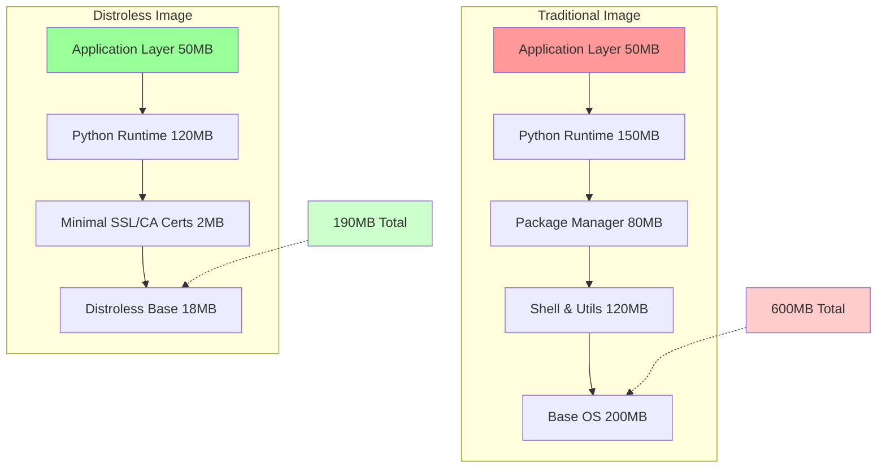
```mermaid
graph TD
    subgraph "Traditional Image"
        A1[Application Layer 50MB]
        A2[Python Runtime 150MB]
        A3[Package Manager 80MB]
        A4[Shell & Utils 120MB]
        A5[Base OS 200MB]
        A1 --> A2
        A2 --> A3
        A3 --> A4
        A4 --> A5
    end
    
    subgraph "Distroless Image"
        B1[Application Layer 50MB]
        B2[Python Runtime 120MB]
        B3[Minimal SSL/CA Certs 2MB]
        B4[Distroless Base 18MB]
        B1 --> B2
        B2 --> B3
        B3 --> B4
    end
    
    C[600MB Total] -.-> A5
    D[190MB Total] -.-> B4
    
    style A1 fill:#ff9999
    style B1 fill:#99ff99
    style C fill:#ffcccc
    style D fill:#ccffcc
```

### Static Linking Dependency Elimination
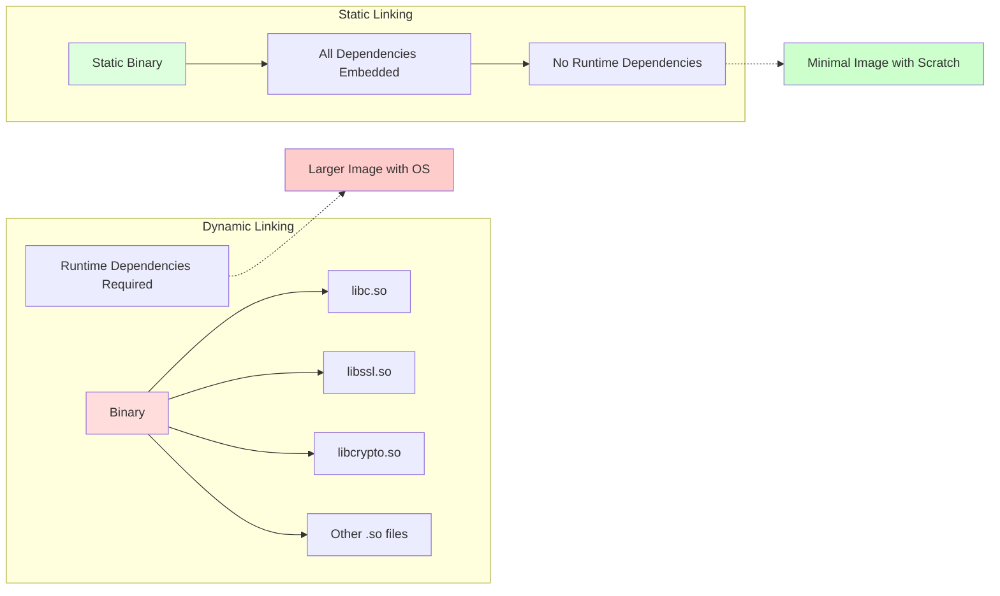
```mermaid
graph LR
    subgraph "Dynamic Linking"
        E1[Binary] --> E2[libc.so]
        E1 --> E3[libssl.so]
        E1 --> E4[libcrypto.so]
        E1 --> E5[Other .so files]
        E6[Runtime Dependencies Required]
    end
    
    subgraph "Static Linking"
        F1[Static Binary]
        F2[All Dependencies Embedded]
        F3[No Runtime Dependencies]
        F1 --> F2
        F2 --> F3
    end
    
    E6 -.-> G[Larger Image with OS]
    F3 -.-> H[Minimal Image with Scratch]
    
    style E1 fill:#ffdddd
    style F1 fill:#ddffdd
    style G fill:#ffcccc
    style H fill:#ccffcc
```

## 🏗️ Multi-Architecture Build Pipeline

### Cross-Platform Build Workflow
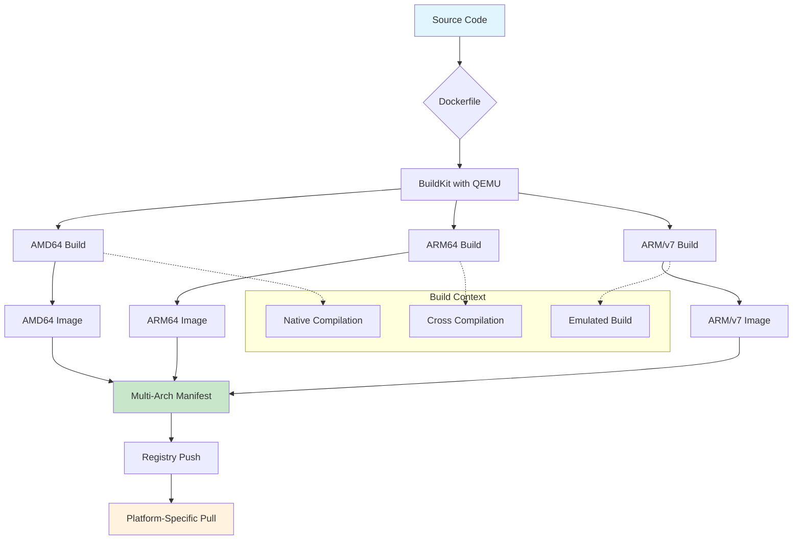
```mermaid
flowchart TD
    A[Source Code] --> B{Dockerfile}
    B --> C[BuildKit with QEMU]
    
    C --> D[AMD64 Build]
    C --> E[ARM64 Build]
    C --> F[ARM/v7 Build]
    
    D --> G[AMD64 Image]
    E --> H[ARM64 Image]
    F --> I[ARM/v7 Image]
    
    G --> J[Multi-Arch Manifest]
    H --> J
    I --> J
    
    J --> K[Registry Push]
    K --> L[Platform-Specific Pull]
    
    subgraph "Build Context"
        M[Native Compilation]
        N[Cross Compilation]
        O[Emulated Build]
    end
    
    D -.-> M
    E -.-> N
    F -.-> O
    
    style A fill:#e1f5fe
    style J fill:#c8e6c9
    style L fill:#fff3e0
```

### Multi-Stage Build Optimization
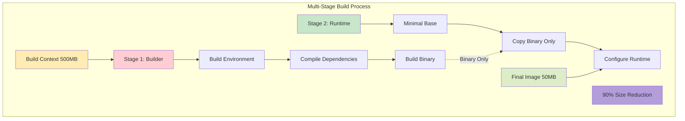
```mermaid
graph TD
    subgraph "Multi-Stage Build Process"
        A[Stage 1: Builder] --> A1[Build Environment]
        A1 --> A2[Compile Dependencies]
        A2 --> A3[Build Binary]
        
        B[Stage 2: Runtime] --> B1[Minimal Base]
        B1 --> B2[Copy Binary Only]
        B2 --> B3[Configure Runtime]
        
        A3 -.->|Binary Only| B2
        
        C[Build Context 500MB] --> A
        D[Final Image 50MB] --> B3
        
        E[90% Size Reduction]
    end
    
    style A fill:#ffcdd2
    style B fill:#c8e6c9
    style C fill:#ffecb3
    style D fill:#dcedc8
    style E fill:#b39ddb
```

## 🔒 Security and Vulnerability Management

### CVE Minimization Strategy
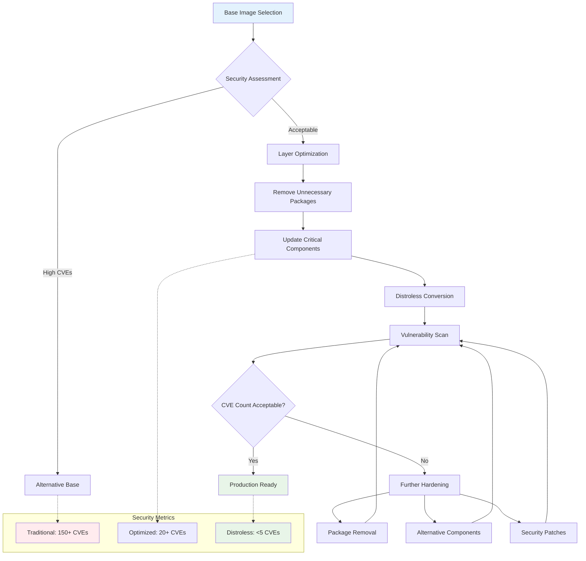
```mermaid
graph TB
    A[Base Image Selection] --> B{Security Assessment}
    B -->|High CVEs| C[Alternative Base]
    B -->|Acceptable| D[Layer Optimization]
    
    D --> E[Remove Unnecessary Packages]
    E --> F[Update Critical Components]
    F --> G[Distroless Conversion]
    
    G --> H[Vulnerability Scan]
    H --> I{CVE Count Acceptable?}
    I -->|No| J[Further Hardening]
    I -->|Yes| K[Production Ready]
    
    J --> L[Package Removal]
    J --> M[Alternative Components]
    J --> N[Security Patches]
    
    L --> H
    M --> H
    N --> H
    
    subgraph "Security Metrics"
        O[Traditional: 150+ CVEs]
        P[Optimized: 20+ CVEs]
        Q[Distroless: <5 CVEs]
    end
    
    C -.-> O
    F -.-> P
    K -.-> Q
    
    style A fill:#e3f2fd
    style K fill:#e8f5e8
    style O fill:#ffebee
    style Q fill:#e8f5e8
```

### Supply Chain Security Flow
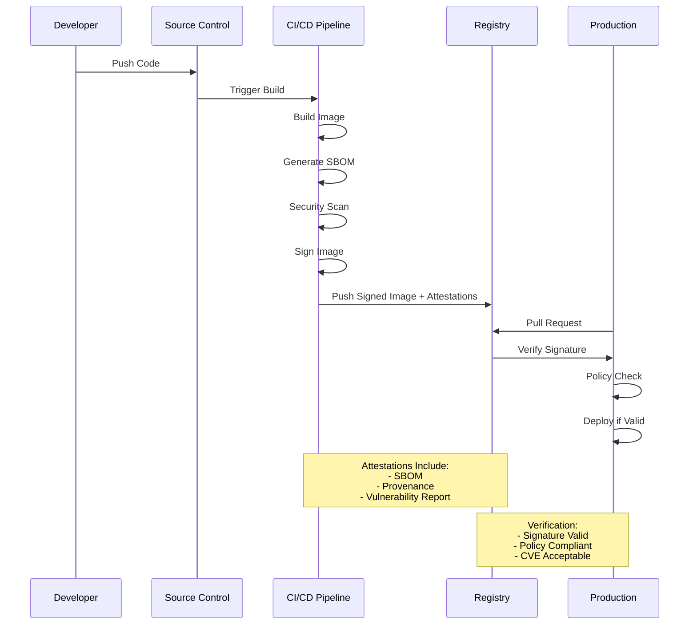
```mermaid
sequenceDiagram
    participant Dev as Developer
    participant SCM as Source Control
    participant CI as CI/CD Pipeline
    participant Reg as Registry
    participant Prod as Production
    
    Dev->>SCM: Push Code
    SCM->>CI: Trigger Build
    CI->>CI: Build Image
    CI->>CI: Generate SBOM
    CI->>CI: Security Scan
    CI->>CI: Sign Image
    CI->>Reg: Push Signed Image + Attestations
    
    Prod->>Reg: Pull Request
    Reg->>Prod: Verify Signature
    Prod->>Prod: Policy Check
    Prod->>Prod: Deploy if Valid
    
    Note over CI,Reg: Attestations Include:<br/>- SBOM<br/>- Provenance<br/>- Vulnerability Report
    Note over Reg,Prod: Verification:<br/>- Signature Valid<br/>- Policy Compliant<br/>- CVE Acceptable
```

## ⚡ Performance Optimization Visuals

### Container Startup Performance
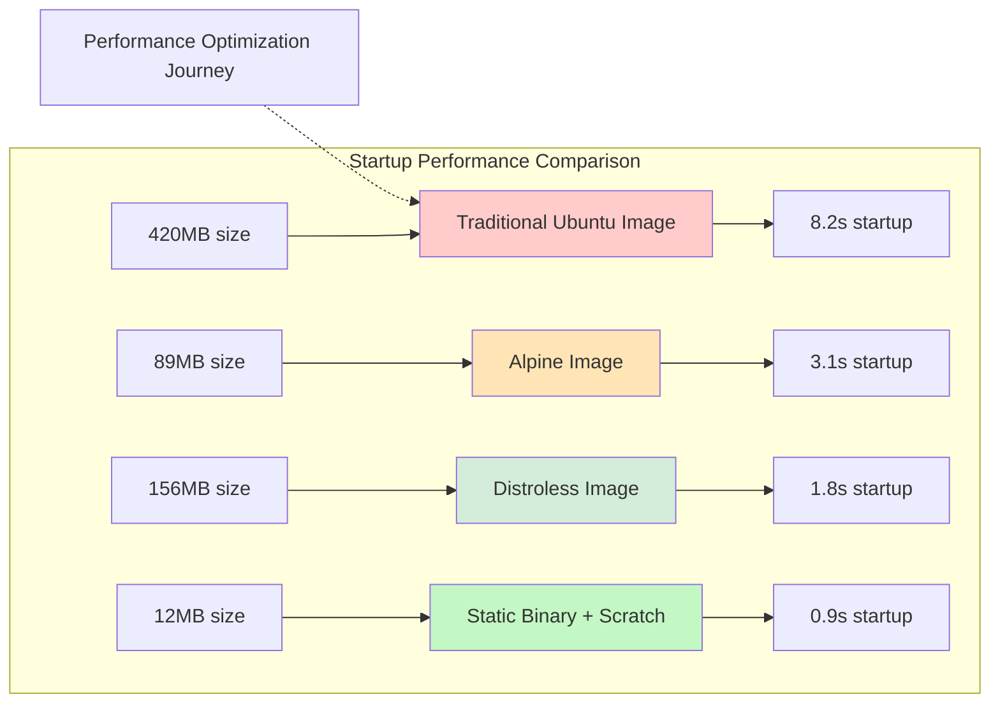
```mermaid
graph LR
    subgraph "Startup Performance Comparison"
        A[Traditional Ubuntu Image]
        B[Alpine Image]
        C[Distroless Image]
        D[Static Binary + Scratch]
        
        A --> A1[8.2s startup]
        B --> B1[3.1s startup]
        C --> C1[1.8s startup]
        D --> D1[0.9s startup]
        
        A2[420MB size] --> A
        B2[89MB size] --> B
        C2[156MB size] --> C
        D2[12MB size] --> D
    end
    
    E[Performance Optimization Journey]
    E -.-> A
    
    style A fill:#ffcccb
    style B fill:#ffe4b5
    style C fill:#d4edda
    style D fill:#c3f7c3
```

### Memory Usage Patterns
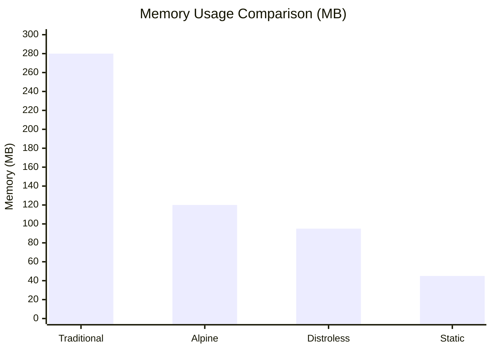
```mermaid
xychart-beta
    title "Memory Usage Comparison (MB)"
    x-axis [Traditional, Alpine, Distroless, Static]
    y-axis "Memory (MB)" 0 --> 300
    bar [280, 120, 95, 45]
```

### Image Size Evolution
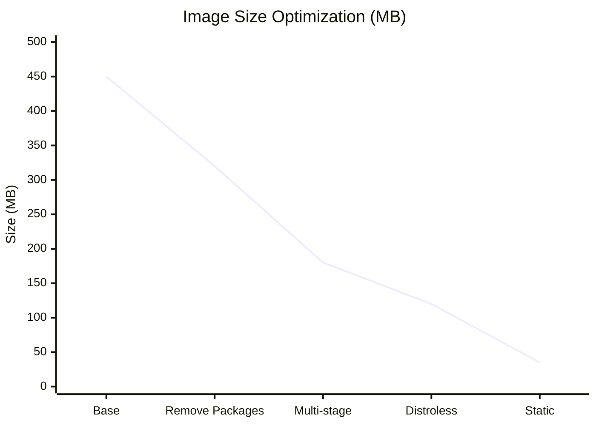
```mermaid
xychart-beta
    title "Image Size Optimization (MB)"
    x-axis [Base, "Remove Packages", "Multi-stage", "Distroless", "Static"]
    y-axis "Size (MB)" 0 --> 500
    line [450, 320, 180, 120, 35]
```

## 🔧 Build Process Workflows

### Advanced Dockerfile Patterns
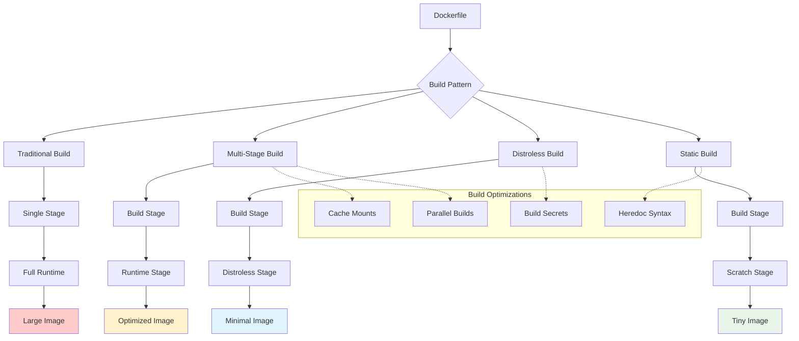
```mermaid
flowchart TD
    A[Dockerfile] --> B{Build Pattern}
    
    B --> C[Traditional Build]
    B --> D[Multi-Stage Build]
    B --> E[Distroless Build]
    B --> F[Static Build]
    
    C --> C1[Single Stage]
    C1 --> C2[Full Runtime]
    C2 --> C3[Large Image]
    
    D --> D1[Build Stage]
    D1 --> D2[Runtime Stage]
    D2 --> D3[Optimized Image]
    
    E --> E1[Build Stage]
    E1 --> E2[Distroless Stage]
    E2 --> E3[Minimal Image]
    
    F --> F1[Build Stage]
    F1 --> F2[Scratch Stage]
    F2 --> F3[Tiny Image]
    
    subgraph "Build Optimizations"
        G[Cache Mounts]
        H[Build Secrets]
        I[Heredoc Syntax]
        J[Parallel Builds]
    end
    
    D -.-> G
    E -.-> H
    F -.-> I
    D -.-> J
    
    style C3 fill:#ffcccb
    style D3 fill:#fff2cc
    style E3 fill:#e1f5fe
    style F3 fill:#e8f5e8
```

### BuildKit Cache Strategy
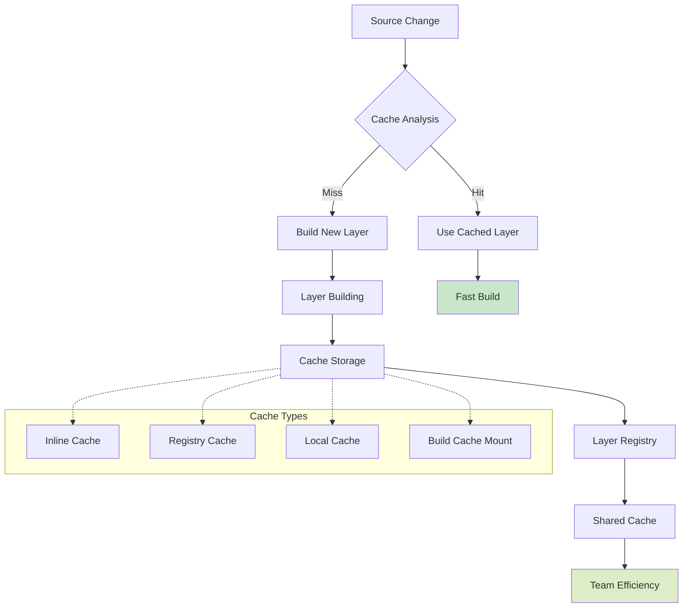
```mermaid
graph TB
    A[Source Change] --> B{Cache Analysis}
    B -->|Hit| C[Use Cached Layer]
    B -->|Miss| D[Build New Layer]
    
    D --> E[Layer Building]
    E --> F[Cache Storage]
    F --> G[Layer Registry]
    
    C --> H[Fast Build]
    G --> I[Shared Cache]
    I --> J[Team Efficiency]
    
    subgraph "Cache Types"
        K[Inline Cache]
        L[Registry Cache]
        M[Local Cache]
        N[Build Cache Mount]
    end
    
    F -.-> K
    F -.-> L
    F -.-> M
    F -.-> N
    
    style H fill:#c8e6c9
    style J fill:#dcedc8
```

## 🌐 Container Registry and Distribution

### Image Signing and Verification Flow
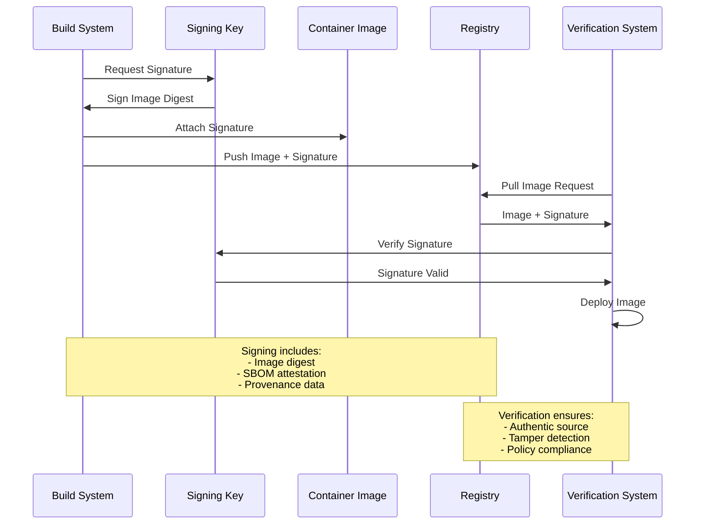
```mermaid
sequenceDiagram
    participant Builder as Build System
    participant Key as Signing Key
    participant Img as Container Image
    participant Reg as Registry
    participant Verifier as Verification System
    
    Builder->>Key: Request Signature
    Key->>Builder: Sign Image Digest
    Builder->>Img: Attach Signature
    Builder->>Reg: Push Image + Signature
    
    Verifier->>Reg: Pull Image Request
    Reg->>Verifier: Image + Signature
    Verifier->>Key: Verify Signature
    Key->>Verifier: Signature Valid
    Verifier->>Verifier: Deploy Image
    
    Note over Builder,Reg: Signing includes:<br/>- Image digest<br/>- SBOM attestation<br/>- Provenance data
    Note over Reg,Verifier: Verification ensures:<br/>- Authentic source<br/>- Tamper detection<br/>- Policy compliance
```

### Multi-Registry Distribution
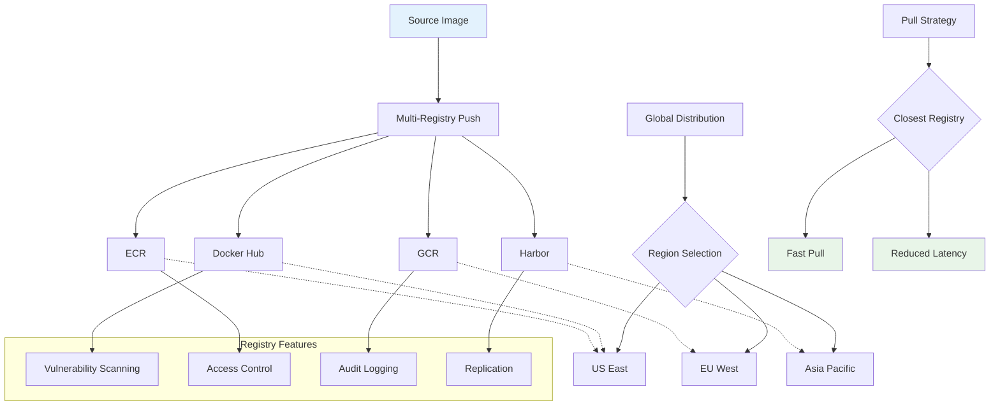
```mermaid
graph TB
    A[Source Image] --> B[Multi-Registry Push]
    
    B --> C[Docker Hub]
    B --> D[ECR]
    B --> E[GCR]
    B --> F[Harbor]
    
    G[Global Distribution] --> H{Region Selection}
    H --> I[US East]
    H --> J[EU West]
    H --> K[Asia Pacific]
    
    C -.-> I
    D -.-> I
    E -.-> J
    F -.-> K
    
    L[Pull Strategy] --> M{Closest Registry}
    M --> N[Fast Pull]
    M --> O[Reduced Latency]
    
    subgraph "Registry Features"
        P[Vulnerability Scanning]
        Q[Access Control]
        R[Audit Logging]
        S[Replication]
    end
    
    C --> P
    D --> Q
    E --> R
    F --> S
    
    style A fill:#e3f2fd
    style N fill:#e8f5e8
    style O fill:#e8f5e8
```

## 🧪 Testing and Quality Assurance

### Image Testing Pipeline
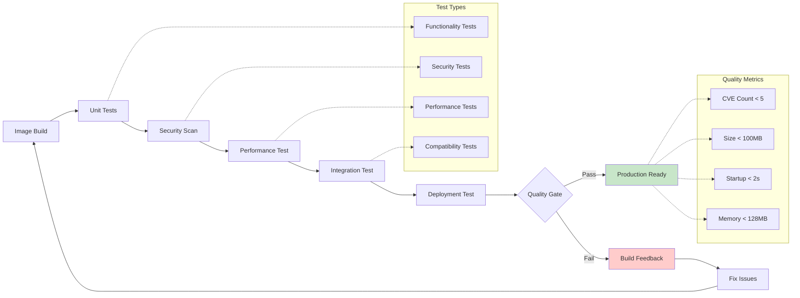
```mermaid
flowchart LR
    A[Image Build] --> B[Unit Tests]
    B --> C[Security Scan]
    C --> D[Performance Test]
    D --> E[Integration Test]
    E --> F[Deployment Test]
    
    F --> G{Quality Gate}
    G -->|Pass| H[Production Ready]
    G -->|Fail| I[Build Feedback]
    I --> J[Fix Issues]
    J --> A
    
    subgraph "Test Types"
        K[Functionality Tests]
        L[Security Tests]
        M[Performance Tests]
        N[Compatibility Tests]
    end
    
    B -.-> K
    C -.-> L
    D -.-> M
    E -.-> N
    
    subgraph "Quality Metrics"
        O[CVE Count < 5]
        P[Size < 100MB]
        Q[Startup < 2s]
        R[Memory < 128MB]
    end
    
    H -.-> O
    H -.-> P
    H -.-> Q
    H -.-> R
    
    style H fill:#c8e6c9
    style I fill:#ffcccb
```

### Security Testing Matrix
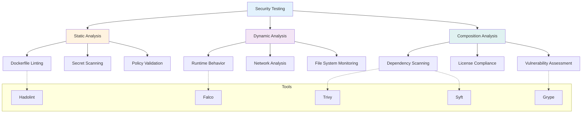
```mermaid
graph TD
    A[Security Testing] --> B[Static Analysis]
    A --> C[Dynamic Analysis]
    A --> D[Composition Analysis]
    
    B --> B1[Dockerfile Linting]
    B --> B2[Secret Scanning]
    B --> B3[Policy Validation]
    
    C --> C1[Runtime Behavior]
    C --> C2[Network Analysis]
    C --> C3[File System Monitoring]
    
    D --> D1[Dependency Scanning]
    D --> D2[License Compliance]
    D --> D3[Vulnerability Assessment]
    
    subgraph "Tools"
        E[Hadolint]
        F[Trivy]
        G[Syft]
        H[Grype]
        I[Falco]
    end
    
    B1 -.-> E
    D1 -.-> F
    D1 -.-> G
    D3 -.-> H
    C1 -.-> I
    
    style A fill:#e3f2fd
    style B fill:#fff3e0
    style C fill:#f3e5f5
    style D fill:#e0f2f1
```

## 📈 Monitoring and Observability

### Container Lifecycle Monitoring
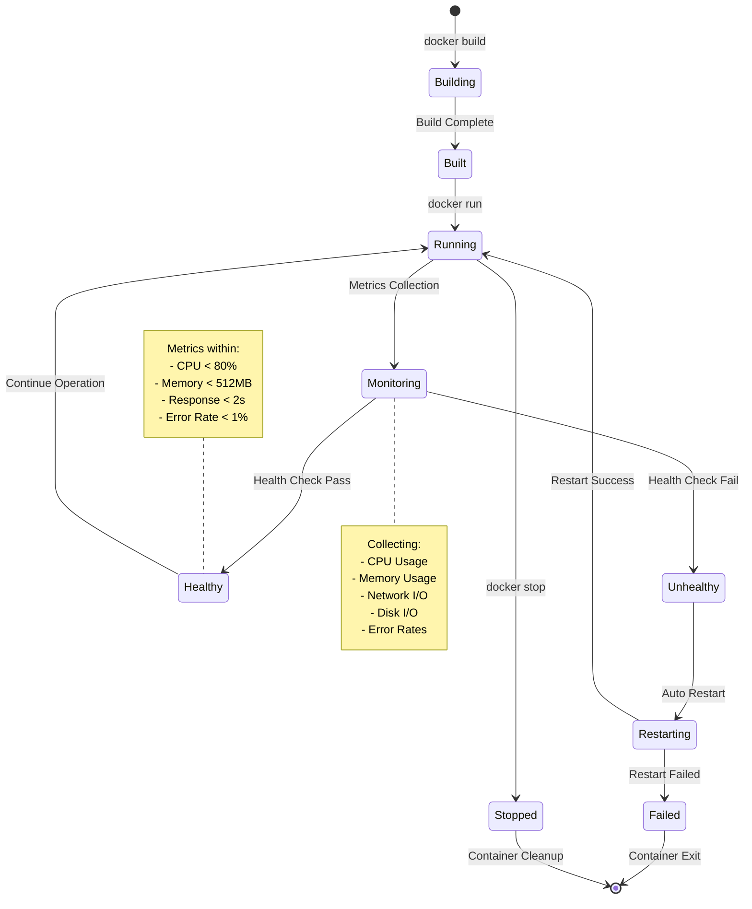
```mermaid
stateDiagram-v2
    [*] --> Building: docker build
    Building --> Built: Build Complete
    Built --> Running: docker run
    Running --> Monitoring: Metrics Collection
    Monitoring --> Healthy: Health Check Pass
    Monitoring --> Unhealthy: Health Check Fail
    Healthy --> Running: Continue Operation
    Unhealthy --> Restarting: Auto Restart
    Restarting --> Running: Restart Success
    Restarting --> Failed: Restart Failed
    Running --> Stopped: docker stop
    Failed --> [*]: Container Exit
    Stopped --> [*]: Container Cleanup
    
    note right of Monitoring
        Collecting:
        - CPU Usage
        - Memory Usage
        - Network I/O
        - Disk I/O
        - Error Rates
    end note
    
    note left of Healthy
        Metrics within:
        - CPU < 80%
        - Memory < 512MB
        - Response < 2s
        - Error Rate < 1%
    end note
```

### Performance Metrics Dashboard
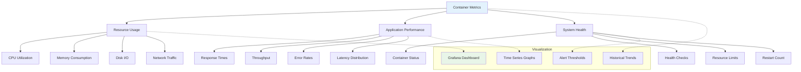
```mermaid
graph TB
    A[Container Metrics] --> B[Resource Usage]
    A --> C[Application Performance]
    A --> D[System Health]
    
    B --> B1[CPU Utilization]
    B --> B2[Memory Consumption]
    B --> B3[Disk I/O]
    B --> B4[Network Traffic]
    
    C --> C1[Response Times]
    C --> C2[Throughput]
    C --> C3[Error Rates]
    C --> C4[Latency Distribution]
    
    D --> D1[Container Status]
    D --> D2[Health Checks]
    D --> D3[Resource Limits]
    D --> D4[Restart Count]
    
    subgraph "Visualization"
        E[Grafana Dashboard]
        F[Time Series Graphs]
        G[Alert Thresholds]
        H[Historical Trends]
    end
    
    B -.-> E
    C -.-> F
    D -.-> G
    A -.-> H
    
    style A fill:#e3f2fd
    style E fill:#e8f5e8
```

## 🚀 Deployment Strategies

### Blue-Green Deployment with Advanced Images
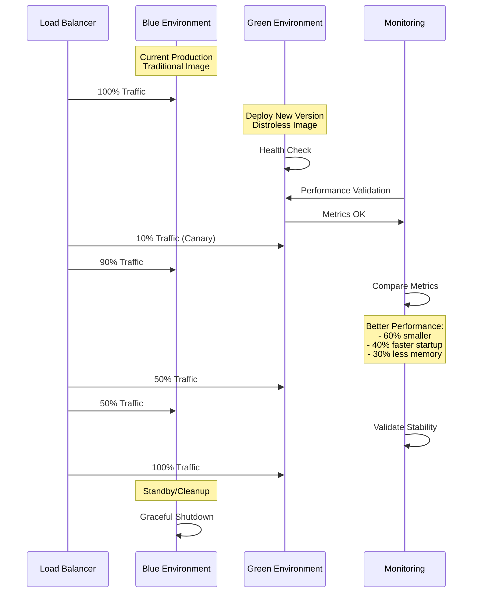
```mermaid
sequenceDiagram
    participant LB as Load Balancer
    participant Blue as Blue Environment
    participant Green as Green Environment
    participant Mon as Monitoring
    
    Note over Blue: Current Production<br/>Traditional Image
    
    LB->>Blue: 100% Traffic
    
    Note over Green: Deploy New Version<br/>Distroless Image
    
    Green->>Green: Health Check
    Mon->>Green: Performance Validation
    Green->>Mon: Metrics OK
    
    LB->>Green: 10% Traffic (Canary)
    LB->>Blue: 90% Traffic
    
    Mon->>Mon: Compare Metrics
    Note over Mon: Better Performance:<br/>- 60% smaller<br/>- 40% faster startup<br/>- 30% less memory
    
    LB->>Green: 50% Traffic
    LB->>Blue: 50% Traffic
    
    Mon->>Mon: Validate Stability
    
    LB->>Green: 100% Traffic
    Note over Blue: Standby/Cleanup
    
    Blue->>Blue: Graceful Shutdown
```

### Container Orchestration Flow
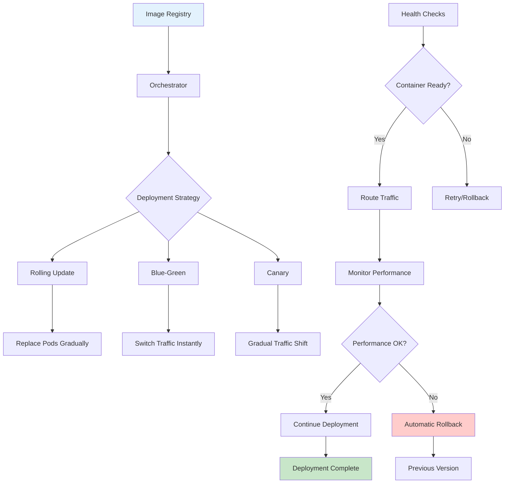
```mermaid
graph TB
    A[Image Registry] --> B[Orchestrator]
    B --> C{Deployment Strategy}
    
    C --> D[Rolling Update]
    C --> E[Blue-Green]
    C --> F[Canary]
    
    D --> D1[Replace Pods Gradually]
    E --> E1[Switch Traffic Instantly]
    F --> F1[Gradual Traffic Shift]
    
    G[Health Checks] --> H{Container Ready?}
    H -->|Yes| I[Route Traffic]
    H -->|No| J[Retry/Rollback]
    
    I --> K[Monitor Performance]
    K --> L{Performance OK?}
    L -->|Yes| M[Continue Deployment]
    L -->|No| N[Automatic Rollback]
    
    N --> O[Previous Version]
    M --> P[Deployment Complete]
    
    style A fill:#e3f2fd
    style P fill:#c8e6c9
    style N fill:#ffcccb
```

---

💡 **Visual Learning**: These diagrams illustrate the complete journey from traditional container images to optimized, secure, and performant advanced images ready for production deployment.